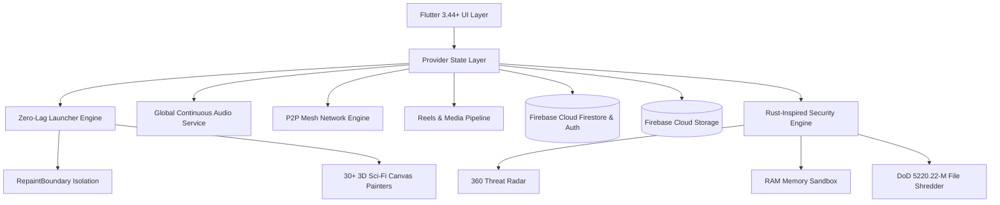

<div align="center">

# ⚡ NEXDROID (NEX-APP)
### *Next-Gen Cyberpunk Tactical Computing, Social & Security Ecosystem*

[](https://flutter.dev)
[](https://dart.dev)
[](https://android.com)
[]()
[]()
[]()

```
███╗   ██╗███████╗██╗  ██╗██████╗ ██████╗  ██████╗ ██╗██████╗ 
████╗  ██║██╔════╝╚██╗██╔╝██╔══██╗██╔══██╗██╔═══██╗██║██╔══██╗
██╔██╗ ██║█████╗   ╚███╔╝ ██║  ██║██████╔╝██║   ██║██║██║  ██║
██║╚██╗██║██╔══╝   ██╔██╗ ██║  ██║██╔══██╗██║   ██║██║██║  ██║
██║ ╚████║███████╗██╔╝ ██╗██████╔╝██║  ██║╚██████╔╝██║██████╔╝
╚═╝  ╚═══╝╚══════╝╚═╝  ╚═╝╚═════╝ ╚═╝  ╚═╝ ╚═════╝ ╚═╝╚═════╝ 
```

**Architected & Developed by [NEXO TECHNOLOGIES](https://nexo-tech-ltd.vercel.app) & [nexchat23-dev-team](https://github.com/nexchat23-dev-team)**

---

</div>

## 🌟 Executive Summary

**NEXDROID** is a cutting-edge, military-grade cyberpunk mobile operating environment built on Flutter and Dart. It unifies high-frequency encrypted messaging, tactical offline mesh networking, real-time cyber defense diagnostics, high-performance media transcoding, a custom 3D vector gaming engine, a persistent background audio engine, and a 60/120 FPS hardware-accelerated command launcher.

---

## 🚀 Core Systems & Flagship Modules

### 1. ⚡ Zero-Lag 60/120 FPS Tactical Launcher (`/home`)
- **Isolated GPU Compositing:** Employs explicit `RepaintBoundary` barriers separating the 30+ interactive background animations from the sliver scroll views and floating navigation docks.
- **Granular Leveling State:** Scoped `AnimatedBuilder` architecture preventing whole-screen tree invalidation when XP/leveling timer ticks fire.
- **Optimized Cyber Slate Surfaces:** High-efficiency `#F5090D1E` and `#E60D1226` dark frosted surfaces replacing expensive multi-pass Gaussian blur readbacks.
- **Dampened Sensor Physics:** Micro-throttled accelerometer and gyroscope listener (`sensors_plus`) eliminating hand jitter recalculations while maintaining responsive 3D parallax.
- **Quick-Access Pinned Deck:** Fast-launch dock for Profile, NEX Chat, Gaming Hub, AI Brain, and Predictive Analytics.

### 2. 🎬 NEX Reels & Video Hub (`/video-feed`, `/video-post`)
- **Intelligent Aspect Ratio Containment:** Automatically presents square and wide videos (`aspectRatio > 0.75`) in uncropped letterbox mode with ambient blurred backdrops.
- **One-Tap Fit/Expand Toggle:** Allows seamless switching between full-bleed cinematic cropping (`BoxFit.cover`) and uncropped preservation (`BoxFit.contain`).
- **Clean Tactical Studio HUD:** Relocated live telemetry, resolution meters, and badge pills below the scrub bar for unobstructed viewing.
- **NEXCHAT Creator Profile Drawer:** Slide-in creator panel featuring verified operative badges, follower/following statistics, live reels showcase, and profile edit sheets.

### 3. 🛍️ Decentralized Market Hub (`/marketplace`)
- **NEXCHAT-Compatible Structure:** Complete market restructuring matching the NEXCHAT marketplace standard.
- **Multi-Category Department Matrix:** Classified sectors for Tactical Gear, Software Exploits, Hardware Mods, Services, and Cyberware.
- **Vendor Trust Index:** Real-time badge indicators, verified merchant status, and encrypted direct in-app buyer-to-seller communication.

### 4. 🎵 Global Continuous Audio Engine (`/music-player`)
- **`GlobalMusicService` Daemon:** Persistent singleton audio management that continues streaming audio seamlessly across app navigation and background system states.
- **Holographic 3D Gyro-Turntable:** Custom `_CyberTurntablePainter` with real-time physics and holo telemetry rings.
- **36-Bar Spectrum Visualizer:** Multi-frequency reactive audio visualizer.
- **DSP Equalizer Matrix:** 6 studio presets: `STUDIO FLAT`, `BASS BOOST`, `CYBER SYNTH`, `SPATIAL 3D`, `VOCAL MATRIX`, and `ELECTRO-PULSE`.
- **Variable Time Warp:** Precision variable playback rate (0.5x – 2.0x).

### 5. 🛡️ Rust Security Hub (`/rust-security-hub`)
- **360° Real-time Threat Radar:** Interactive sweep painter scanning simulated hostile network nodes.
- **Composite Threat Score (0–100):** Weighted risk evaluation across memory, open sockets, and app permissions.
- **Emergency Lockdown Protocol:** Instant sandbox quarantine and process kill switch.
- **64-Block RAM Matrix:** Live visualization of allocated, sandboxed, and free memory blocks.
- **Hardware MFLOPS Benchmark:** Multi-threaded mathematical compute rating engine.

### 6. 📁 Cyber File Manager & DoD Shredder (`/file-manager`)
- **512-Byte Hex Dump Inspector:** Direct byte-level hex and ASCII view with offset addresses.
- **DoD 5220.22-M 3-Pass Shredder:** Cryptographic overwrite destruction protocol for zero-recovery file deletion.
- **Partition Telemetry:** Visual disk usage, inode counters, and mount health indicators.

### 7. 🎬 Nexus Media Interceptor (`/media-downloader`)
- **Perspective Warp Tunnel:** Shader-style radial velocity visualizer.
- **4-Lane Multi-Thread Engine:** Parallel download chunking simulation with individual lane metrics.
- **Transcode Format Matrix:** Supports 4K Ultra, 1080p FHD, 720p HD, WEBM VP9, MKV HEVC, MP3 320k, AAC, and FLAC.
- **Universal Sniffer:** Automatic URL sniffing for YouTube, TikTok, Instagram, X/Twitter, SoundCloud, Spotify, and direct CDN streams.

### 8. 🎯 Nexus Targeting HUD (`/auto-tracker`)
- **Fighter Jet HUD Reticle:** Military corner brackets, target crosshairs, rotating acquisition rings, and bearing telemetry.
- **5 Vision Modes:** GPU matrix-filtered modes: `NORMAL`, `THERMAL`, `NIGHT-VIS`, `EDGE-DETECT`, and `MATRIX`.
- **Live ML Kit Classification:** Real-time object classification (Human, Vehicle, Bike, Structure) with threat rating (`HIGH`, `MEDIUM`, `LOW`).

### 9. 💻 Command Deck Terminal (`/terminal`)
- **CRT Phosphor Screen:** Scanline rendering, vignette curvature, chromatic aberration text glow, and flicker simulation.
- **Hardware Telemetry Strip:** Live CPU gauge, RAM monitor, network stability, and session uptime counter.
- **Interactive Process Monitor (`top`):** Live task table with PID, process name, CPU%, MEM%, and thread states.
- **Crypto File Encryptor (`encrypt <text>`):** AES-256-GCM cipher generator.
- **Matrix Digital Rain (`matrix`):** Fullscreen animated falling glyph shower.

### 10. 🎮 3D Vector Combat Engine (`cyber_3d_engine.dart`)
- True perspective 3D software rendering engine (pitch, yaw, roll, camera translation, depth projection).
- Starfighter 3D space arena with hostile interceptors, laser projectiles, starry spacefield, and particle explosion physics.

### 11. 📡 Tactical Mesh Suite (`/offline-mesh`)
- Peer-to-peer Bluetooth Low Energy (BLE) and Wi-Fi Direct mesh communication without cellular or internet connectivity.
- Offline device discovery, mesh chat, and proximity radar.

### 12. 🎖️ Operative Level Progression & Milestones
- Dynamic XP engine with unlockable futuristic profile avatars:
  - **Level 100:** Neon Grid Vanguard
  - **Level 1,000:** Cybernetic Neural Overlord
  - **Level 10,000:** Quantum Singularity Entity
  - **Level 100,000:** Cosmic Omnipresence

---

## 🏗️ System Architecture



---

## 🛠️ Prerequisites & Environment

| Dependency | Minimum Version | Recommended | Notes |
|---|---|---|---|
| **Flutter SDK** | `>= 3.24.0` | `3.44.x` | Verify via `flutter --version` |
| **Dart SDK** | `>= 3.3.0` | `3.5.x` | Bundled with Flutter |
| **Java Development Kit** | `JDK 17` | OpenJDK 17 / Eclipse Temurin 17 | Required for Gradle 8+ & AGP |
| **Android SDK** | API 34+ | API 34 / 35 | Install via Android Studio SDK Manager |
| **Android NDK** | `26.x+` | Standard Flutter NDK | Required for C++/native plugins |

---

## 📦 Build & Compilation Guide

### Step 1: Clone Repository
```bash
git clone https://github.com/nexchat23-dev-team/NEXDROID.git
cd NEXDROID
```

### Step 2: Accept Android Licenses (First Run)
```bash
flutter doctor --android-licenses
```

### Step 3: Install Package Dependencies
```bash
flutter pub get
```

### Step 4: Compile Android APK

#### Production Release APK (Recommended)
```bash
flutter build apk --release
```
> **Output:** `build/app/outputs/flutter-apk/app-release.apk`

#### Split Architecture APKs (Smaller binary footprint)
```bash
flutter build apk --split-per-abi --release
```
> **Outputs:**
> - `build/app/outputs/flutter-apk/app-arm64-v8a-release.apk` (Modern 64-bit devices, recommended)
> - `build/app/outputs/flutter-apk/app-armeabi-v7a-release.apk` (Legacy 32-bit devices)
> - `build/app/outputs/flutter-apk/app-x86_64-release.apk` (Emulators / ChromeOS)

#### Debug APK (Rapid local development)
```bash
flutter build apk --debug
```

---

## 📲 Deployment to Android Device

### Method 1: ADB Direct Installation (USB Debugging)
```bash
adb install -r build/app/outputs/flutter-apk/app-release.apk
```

### Method 2: Sideload via Desktop
1. Locate the compiled APK at `c:\Users\Baha\Desktop\NEXDROID.apk`.
2. Transfer to your Android device via USB, Google Drive, or local storage.
3. Open the APK on the device and confirm "Install from Unknown Sources".

---

## 🗂️ Codebase Organization

```
NEX-APP/
├── android/                             # Android native Gradle configuration
│   ├── app/
│   │   ├── build.gradle.kts             # Gradle build script (Java 17, desugaring)
│   │   ├── google-services.json         # Firebase project credentials
│   │   └── src/main/AndroidManifest.xml # Permissions (Foreground audio, Camera, BLE)
├── assets/                              # Brand icons, sound effects, milestone avatars
│   ├── icon/app_icon.png
│   ├── audio/
│   └── images/
├── lib/
│   ├── main.dart                        # Main application bootstrap & routing
│   ├── engine/                          # 3D software rendering engine & math
│   ├── models/                          # Strongly-typed data models (User, Post, Reel)
│   ├── providers/                       # State providers (TokenProvider, AnimationProvider)
│   ├── screens/                         # UI Screens
│   │   ├── home_screen.dart             # Zero-lag 60FPS launcher & dock
│   │   ├── video_feed_screen.dart       # Tactical Reels feed & creator drawer
│   │   ├── video_post_screen.dart       # Video studio & metadata composer
│   │   ├── marketplace_screen.dart      # Decentralized cyber marketplace
│   │   ├── music_player_screen.dart     # Turntable audio player & DSP EQ
│   │   ├── rust_security_hub_screen.dart# 360 threat radar & sandbox
│   │   ├── file_manager_screen.dart     # Hex viewer & DoD file shredder
│   │   ├── media_downloader_screen.dart # Multi-threaded media interceptor
│   │   ├── auto_tracker_screen.dart     # HUD ML target classifier
│   │   ├── terminal_screen.dart         # CRT retro phosphor terminal
│   │   └── ...
│   ├── services/                        # Hardware & background services
│   │   ├── global_music_service.dart    # Continuous background audio daemon
│   │   ├── reel_service.dart            # Video reels & creator profiles
│   │   ├── marketplace_service.dart     # Market transactions & catalog
│   │   ├── user_leveling_service.dart   # XP progression & milestone state
│   │   └── ...
│   ├── utils/                           # Cyberpunk design system (colors, typography)
│   └── widgets/                         # Reusable scifi animations & painters
└── pubspec.yaml                         # Flutter dependency definitions
```

---

## 👥 Credits & Development Team

- **Organization:** [NEXO TECHNOLOGIES](https://nexo-tech-ltd.vercel.app)
- **Repository:** [nexchat23-dev-team/NEXDROID](https://github.com/nexchat23-dev-team/NEXDROID)
- **Lead Architecture & Development:** [anonyemichael](https://github.com/anonyemichael)
- **Security Engineering & Research:** [alexhack235-code / REDOX-PY_SCANNER](https://github.com/alexhack235-code/REDOX-PY_SCANNER.git)

---

<div align="center">
<b>NEXDROID — The Future of Tactical Mobile Computing</b>
</div>
